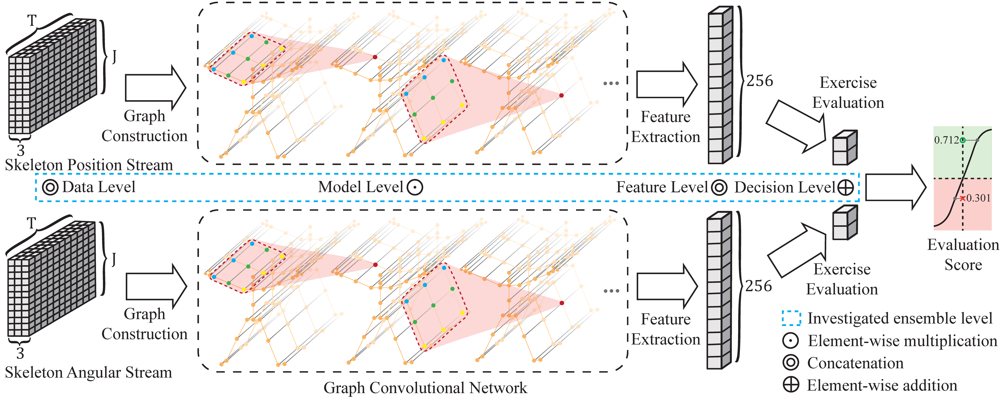
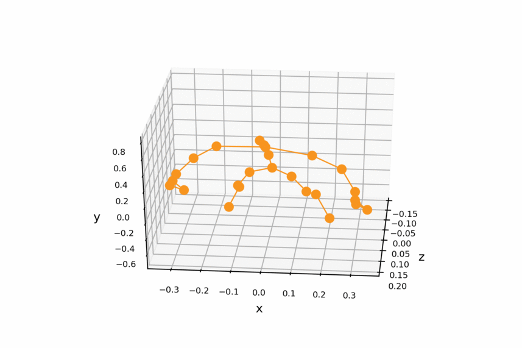
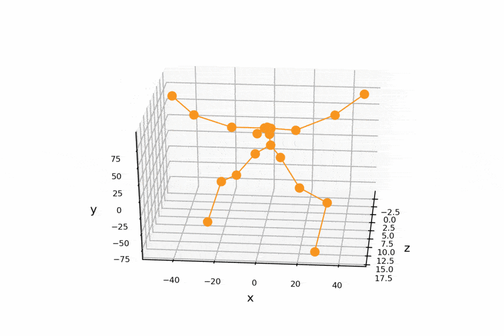
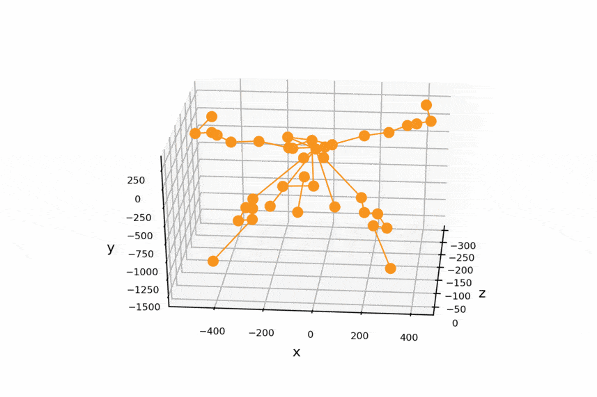
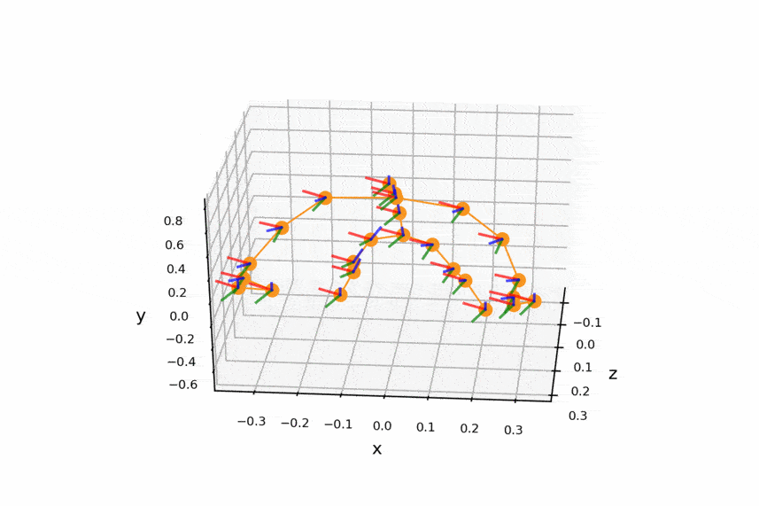
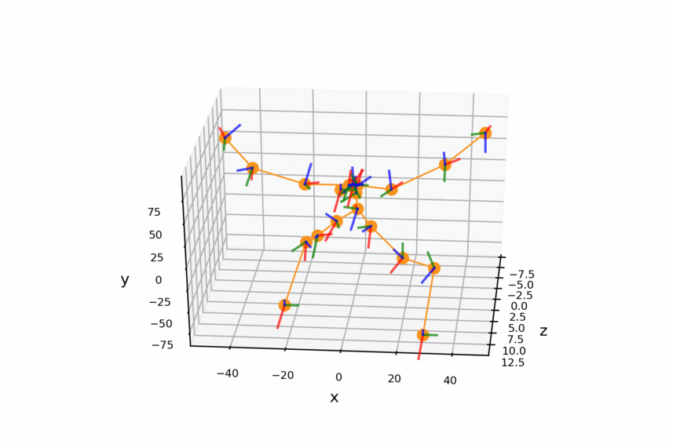
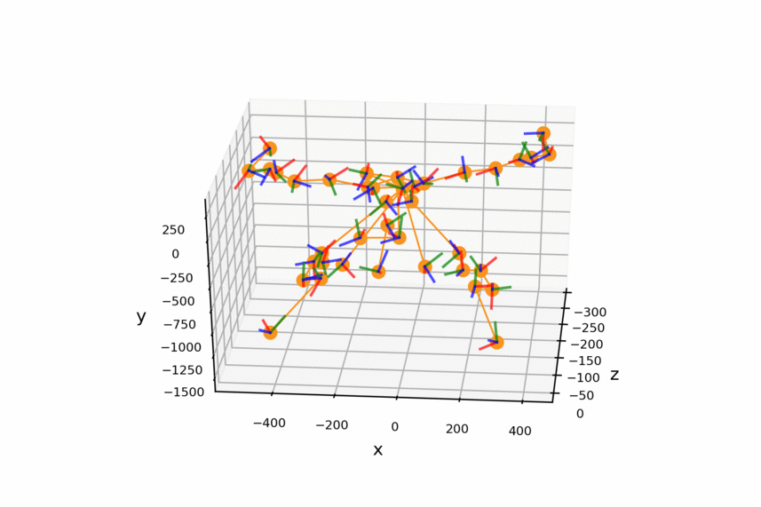
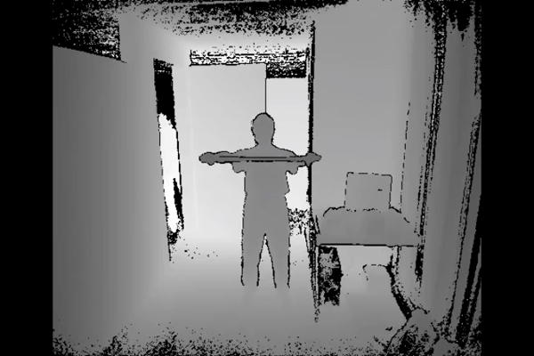

# Ensemble-based Graph Convolutional Networks (EGCN)
Effective Skeleton-based Rehabilitation Exercise Assessment with Ensemble-based Graph Convolutional Networks.
This repository holds the codebase, dataset and models for the review purpose of CVPR 2021 submission 2156.

## Introduction
Rehabilitation exercise aims to restore physical functions from injury. With the release of motion sensors like Kinect, skeleton-based rehabilitation assessment attracts increasing research interest in computer vision. Existing attempts on skeleton-based rehabilitation exercise assessment usually rely on geometric features or statistical methods, which is a lack of effective skeleton data representation methods. Usually, skeleton data could be collected with sensors like Kinect or motion captures that provide two groups of features (i.e., position and orientation features). Graph Convolutional Network (GCN) has achieved encouraging performance for skeleton-based action recognition. However, it might not be able to fully make use of different features of the skeleton data. To advance the prior work, we propose an Ensemble-based GCN (EGCN) learning framework for rehabilitation exercise assessment.

<div align="center">
    
</div>

## Visulization of Position (Pos) and Angular (Ang) Features of Skeleton Joints.
EGCN is able to make use of the position and angular features of the skeleton data for exercise evaluation purpose.
Below figures show the visulized views of the skeleton features from **KIMORE** and **UI-PRMD** datasets. The first row of below figures is 3d position features, and the second row is the angular features (a.k.a. orientation features).

<table style="width:100%; table-layout:fixed;">
  <tr>
    <td></td>
    <td></td>
    <td></td>
  </tr>
  <tr>
    <td><font size="1">Pos KIMORE (Kinect v2)<font></td>
    <td><font size="1">Pos UI-PRMD (Kinect v2)<font></td>
    <td><font size="1">Pos UI-PRMD (Vicon)<font></td>
  </tr>
  <tr>
    <td></td>
    <td></td>
    <td></td>
  </tr>
  <tr>
    <td><font size="1">Ang KIMORE (Kinect v2)<font></td>
    <td><font size="1">Ang UI-PRMD (Kinect v2)<font></td>
    <td><font size="1">Ang UI-PRMD (Vicon)<font></td>
  </tr>
</table>

## Prerequisites
Our codebase is based on **Python3** (>=3.5). There are a few dependencies to run the code. The major libraries we depend are
- [PyTorch](http://pytorch.org/) (Release version 0.4.0)
- [Openpose@92cdcad](https://github.com/yysijie/openpose) (Optional: for demo only)
- FFmpeg (Optional: for demo only), which can be installed by `sudo apt-get install ffmpeg`
- Other Python libraries can be installed by `pip install -r requirements.txt`

### Installation
```
cd torchlight; python setup.py install; cd ..
```

### Get pretrained models
We provided the pretrained model weithts of our **ST-GCN**. The model weights can be downloaded by running the script
```
bash tools/get_models.sh
```
The downloaded models will be stored under ```./models```.
<!-- If you get an error message after running above command, you can also obtain models from [GoogleDrive](https://drive.google.com/open?id=1koTe3ces06NCntVdfLxF7O2Z4l_5csnX) or [BaiduYun](https://pan.baidu.com/s/1dwKG2TLvG-R1qeIiE4MjeA#list/path=%2FShare%2FAAAI18%2Fst-gcn&parentPath=%2FShare), and manually put them into ```./models```. -->


## Data Preparation

We experimented on two skeleton-based action evaluation datasts: **UI-PRMD** and **KIMORE**.

### UI-PRMD
[Kinetics](https://deepmind.com/research/open-source/open-source-datasets/kinetics/) is a video-based dataset for action recognition which only provide raw video clips without skeleton data. Kinetics dataset include To obatin the joint locations, we first resized all videos to the resolution of 340x256 and converted the frame rate to 30 fps.  Then, we extracted skeletons from each frame in Kinetics by [Openpose](https://github.com/CMU-Perceptual-Computing-Lab/openpose). The extracted skeleton data we called **Kinetics-skeleton**(7.5GB) can be directly downloaded from [GoogleDrive](https://drive.google.com/open?id=1SPQ6FmFsjGg3f59uCWfdUWI-5HJM_YhZ) or [BaiduYun](https://pan.baidu.com/s/1dwKG2TLvG-R1qeIiE4MjeA#list/path=%2FShare%2FAAAI18%2Fkinetics-skeleton&parentPath=%2FShare).

After uncompressing, rebuild the database by this command:
```
python tools/kinetics_gendata.py --data_path <path to kinetics-skeleton>
```

### KIMORE
For the **KIMORE** dataset, we perform manul segmentation on based on exercise specific features. Below are 8 samples of the exercises segmented from **KIMORE**. Es2-4 are segmented as the left and right directions.

<table style="width:100%; table-layout:fixed;">
  <tr>
    <td></td>
    <td></td>
    <td></td>
    <td></td>
  </tr>
  <tr>
    <td><font size="1">KIMORE Es1<font></td>
    <td><font size="1">KIMORE Es2(L)<font></td>
    <td><font size="1">KIMORE Es3(L)<font></td>
    <td><font size="1">KIMORE Es4(L)<font></td>
  </tr>
  <tr>
    <td></td>
    <td></td>
    <td></td>
    <td></td>
  </tr>
  <tr>
    <td><font size="1">KIMORE Es2(R)<font></td>
    <td><font size="1">KIMORE Es3(R)<font></td>
    <td><font size="1">KIMORE Es4(R)<font></td>
    <td><font size="1">KIMORE Es5<font></td>
  </tr>
</table>

KIMORE can be downloaded from [their website](https://vrai.dii.univpm.it/content/kimore-dataset). After that, this command should be used to build the database for training or evaluation:
```
python tools/ntu_gendata.py --data_path <path to nturgbd+d_skeletons>
```
where the ```<path to nturgbd+d_skeletons>``` points to the 3D skeletons modality of NTU RGB+D dataset you download.

## Testing Pretrained Models

<!-- ### Evaluation
Once datasets ready, we can start the evaluation. -->

To evaluate ST-GCN model pretrained on **Kinetcis-skeleton**, run
```
python main.py recognition -c config/st_gcn/kinetics-skeleton/test.yaml
```

<!-- For **cross-view** evaluation in **NTU RGB+D**, run
```
python main.py --config config/st_gcn/nturgbd-cross-view/test.yaml
```
For **cross-subject** evaluation in **NTU RGB+D**, run
```
python main.py --config config/st_gcn/nturgbd-cross-subject/test.yaml
``` -->

<!-- Similary, the configuration file for testing baseline models can be found under the ```./config/baseline```. -->

To speed up evaluation by multi-gpu inference or modify batch size for reducing the memory cost, set ```--test_batch_size``` and ```--device``` like:
```
python main.py recognition -c <config file> --test_batch_size <batch size> --device <gpu0> <gpu1> ...
```

### Results
The expected **Top-1** **accuracy** of provided models are shown here:

| Model| Kinetics-<br>skeleton (%)|NTU RGB+D <br> Cross View (%) |NTU RGB+D <br> Cross Subject (%) |
| :------| :------: | :------: | :------: |
|Baseline[1]| 20.3    | 83.1     |  74.3    |
|**ST-GCN** (Ours)| **30.8**| **88.9** | **80.7** |

[1] Kim, T. S., and Reiter, A. 2017. Interpretable 3d human action analysis with temporal convolutional networks. In BNMW CVPRW.

## Training
To train a new ST-GCN model, run
```
python main.py recognition -c config/st_gcn/kinetics-skeleton/train.yaml [--work_dir <work folder>]
```
<!-- ```
python main.py recognition -c config/st_gcn/<dataset>/train.yaml [--work_dir <work folder>]
```
where the ```<dataset>``` must be ```nturgbd-cross-view```, ```nturgbd-cross-subject``` or ```kinetics-skeleton```, depending on the dataset you want to use. -->
The training results, including **model weights**, configurations and logging files, will be saved under the ```./work_dir``` by default or ```<work folder>``` if you appoint it.

You can modify the training parameters such as ```work_dir```, ```batch_size```, ```step```, ```base_lr``` and ```device``` in the command line or configuration files. The order of priority is:  command line > config file > default parameter. For more information, use ```main.py -h```.

Finally, custom model evaluation can be achieved by this command as we mentioned above:
```
python main.py -c config/st_gcn/<dataset>/test.yaml --weights <path to model weights>
```


## Contact
For any question, feel free to contact
```
xxx     : xxx@xxx
xxx     : xxx@xxx
```
